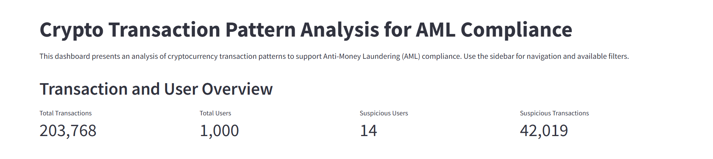
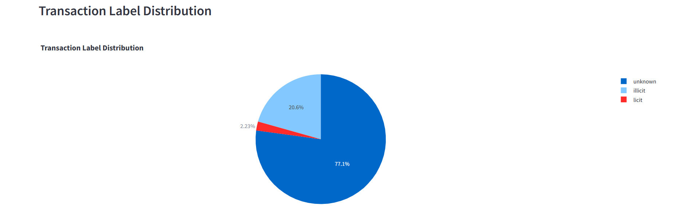
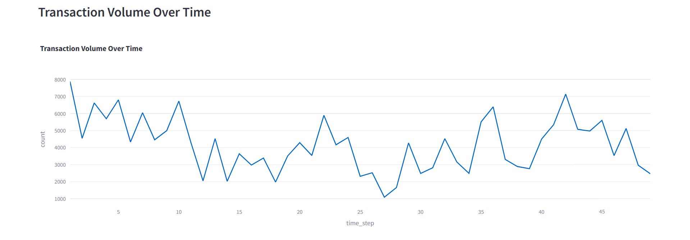
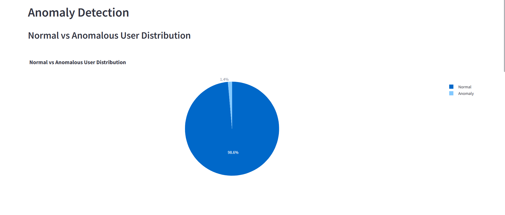
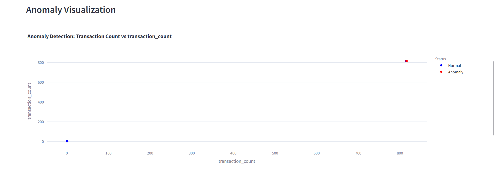
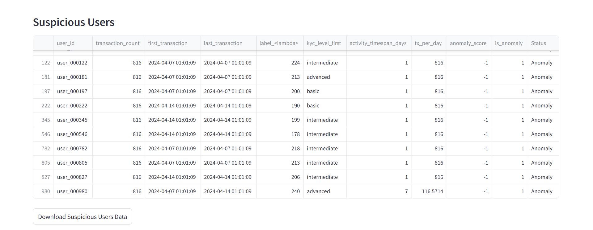

# Crypto Transaction Pattern Analysis for AML Compliance

## 📊 Project Summary
This project aims to develop a comprehensive analytics system to enhance Anti-Money Laundering (AML) compliance on cryptocurrency transaction platforms. By leveraging data engineering techniques, machine learning algorithms, and interactive data visualizations, the system efficiently detects suspicious transaction patterns and identifies high-risk users.

### Key Statistics
- **203,768** Transactions analyzed  
- **1,000** Users profiled  
- **14** Suspicious users identified  
- **42,019** Suspicious transactions detected  

## 🔎 Key Features
### 1. Transaction Label Distribution Analysis  
Analysis indicates that **77.1%** of transactions are unclassified (unknown), **20.6%** are identified as illicit, and only **2.23%** are labeled as licit. The high proportion of unclassified and illicit transactions underscores the necessity of sophisticated detection systems.

### 2. Transaction Volume Monitoring  
The analysis reveals significant fluctuations in transaction volume over time, with peaks reaching approximately **8,000 transactions** and troughs around **1,000 transactions**. Identifying unusual spikes aids in detecting potential coordinated suspicious activities.

### 3. User Profiling  
Transaction distribution per user displays a **bimodal pattern**, where most users conduct very few transactions, while a small group of users execute a significantly higher number of transactions (**800+ transactions**). This pattern suggests possible structuring or smurfing activities.

### 4. Advanced Anomaly Detection  
Our anomaly detection system identifies **1.4% of users** as potentially suspicious by utilizing multiple machine learning algorithms, including:
- Isolation Forest
- Local Outlier Factor (LOF)
- One-Class SVM

### 5. Suspicious User Identification  
The system successfully flagged **14 suspicious users** with anomalous transaction patterns. These users executed **816 transactions** within a **single day**, indicating abnormally high transaction frequency.

## 📈 Methodology
This project employs a multi-faceted approach to AML compliance:
- **Data Integration** – Merging transaction data with user KYC information
- **Feature Engineering** – Creating behavioral indicators for anomaly detection
- **Machine Learning** – Implementing multiple anomaly detection algorithms
- **Ensemble Techniques** – Combining model outputs for higher accuracy
- **Risk Scoring** – Developing a structured risk assessment framework
- **Interactive Visualization** – Building a real-time monitoring dashboard

## 📊 Interactive Dashboard
A **Streamlit** dashboard has been developed to assist compliance officers in:
- Filtering transactions by time period, labels, and KYC levels
- Visualizing transaction patterns and anomalies
- Investigating specific suspicious users
- Downloading reports for further analysis

## 📑 Detailed Reports
For in-depth analysis, refer to the following reports:
- [Anomaly Detection Report](report/anomaly_report.pdf) – Insights into anomaly detection methodologies and results
- [Risk Assessment Report](report/risk_report.pdf) – Comprehensive breakdown of risk scoring methods
- [User Profiling Report](report/user_profile.pdf) – Identification of behavioral patterns and suspicious activities
- [Overview Report](report/overview.pdf) – Executive summary of key findings

## 🛠️ Technologies Used
- **Python** – Core programming language
- **Pandas & NumPy** – Data manipulation and analysis
- **Scikit-learn** – Machine learning algorithms
- **dbt** – Data transformation workflows
- **Plotly & Matplotlib** – Data visualization
- **Streamlit** – Interactive dashboard development
- **SQL** – Database querying and modeling

## 🚀 Future Enhancements
- **Real-time Processing** – Implementing stream processing for live transaction monitoring
- **Network Analysis** – Graph-based analysis of transaction networks
- **Explainable AI** – Enhancing interpretability of anomaly detection models
- **Regulatory Reporting** – Automating compliance reporting for authorities
- **Alert Management** – Developing a case management system for alert investigations

## 📞 Contact
For more information, please reach out to:

**Name:** Nugrah Salam  
**Email:** ompekp@gmail.com  
**GitHub:** [envexx](https://github.com/envexx)

---
This project was developed as a portfolio piece showcasing advanced data analytics capabilities in cryptocurrency compliance.

